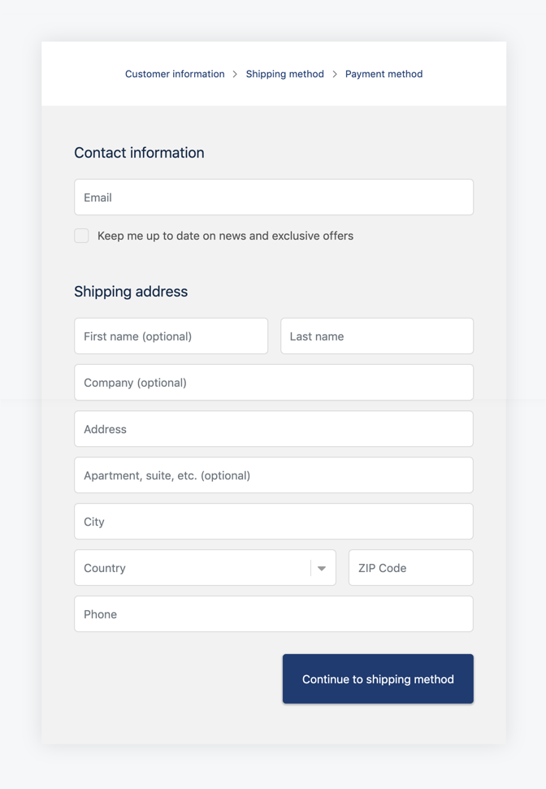

Laraform is a full-stack form builder for Laravel & Vue.js.

Create even the most complex forms with ease, using two-sided validation,   eloquent, nested elements, conditional logic, wizards and many more.

## Features

Some of the key features of Laraform:

* Two-sided validation
* 54 Laravel compatible frontend validators
* Eloquent ORM support
* Multiple file uploads
* 34 built-in elements
* Nested elements
* Repeatable elements
* Translatable elements
* Conditional logic
* Form wizard
* Localization
* Theming
* Extensibility

## Examples

* [Shopify checkout clone](https://laraform.io/examples#shopify)
* [Login with backend support](https://laraform.io/examples#login)
* *More coming soon*

## Browser Support

Laraform aims to support the latest versions of:

* Google Chrome
* Firefox
* Apple Safari
* Microsoft Edge
* Opera
* Internet Explorer 10+
* Safari iOS
* Chrome, Firefox and Default Browser Android

## Installation

Laraform comes with a separated backend & frontend library which can be used together or on their own. Checkout out our [Installation guide](https://laraform.io/docs/installation) to find which suits you the best.

## Documentation

[Developer Guide](https://laraform.io/docs/rendering) and [API Reference](https://laraform.io/docs/api-laraform) is available at Laraform website.

## Issue Tracking

Laraform uses [GitHub Issues](/laraform/laraform/issue) for official bug tracking. Please follow our issue template to help us hunt down bugs as efficiently as possible.

## Support & Contribution

If you have any questions about Laraform or interested in contributing, please drop us a line at hello@laraform.io. We are happy for receiving feedbacks as well as growing our enthusiastic developer team.

## License

Laraform has a non-commercial and a commercial version. Download Laraform for free or purchase a commercial license [here](https://laraform.io/pricing).