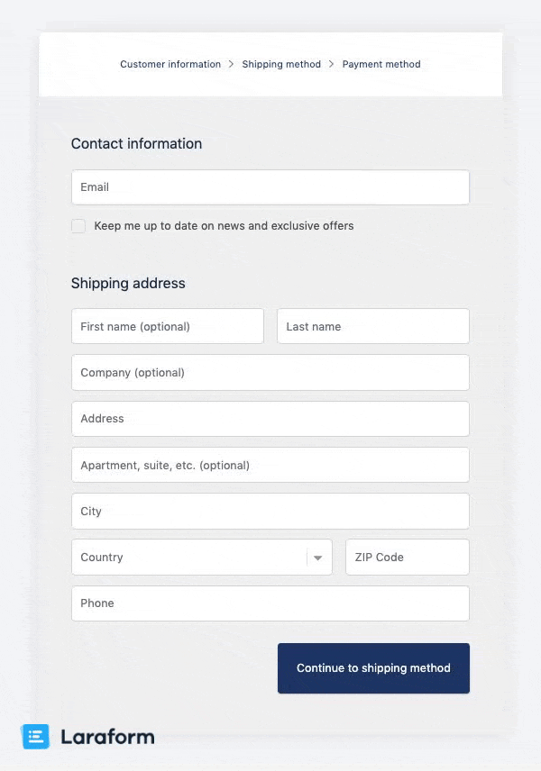

<div align="center">

<a href="https://laraform.io"></a>

Reactive form builder for Vue.js with Laravel support

Create even the most complex forms with ease, using two-sided validation, <br> eloquent, nested elements, conditional logic, wizards and many more.

<a href="https://laraform.io"></a>

</div>

# Laraform Community Edition (Vue.js)

Laraform is a premium library aiming to become the world's best form builder tool for web developers. It enhances collaboration by standardizing the creation of forms and increases efficiency by eliminating tons of repetitive work. Laraform comes with a lighter "Community Edition" and a full version which can be purchased at our website.

## Features

Full features of Laraform:

* Two-sided validation
* 54 Laravel compatible frontend validators
* Eloquent ORM support
* Multiple file uploads
* 34+ built-in elements
* Nested elements
* Repeatable elements
* Translatable elements
* Conditional logic
* Form wizard
* Localization
* Theming
* Extensibility

## Examples

* [Shopify checkout clone](https://laraform.io/examples#shopify)
* [Login with backend support](https://laraform.io/examples#login)
* [Element examples](https://laraform.io/examples#elements)

## Browser Support

Laraform aims to support the latest versions of:

* Google Chrome
* Firefox
* Apple Safari
* Microsoft Edge
* Opera
* Safari iOS
* Chrome, Firefox and Default Browser Android

## Installation

Laraform is a full-stack library which comes with a separate frontend and backend library. This will install Laraform's Community Edition. For the full package please [check out our website](https://laraform.io/pricing).

Install frontend library for Vue.js:

``` bash
npm i laraform --save
```

Make sure you have the following peer dependencies installed:

```
npm i axios lodash moment vue --save
```

Install backend library for Laravel:

``` bash
composer require laraform/laraform-laravel
```

Publish assets:
``` bash
php artisan vendor:publish
```

When asked, choose: `Laraform\LaraformServiceProvider`. This will publish a config file at `config/laraform.php`.

## Usage

Create a form at `app\Forms\FirstForm.php`:

``` php
<?php

namespace App\Forms;

class FirstForm extends \Laraform
{
  public function schema() {
    return [
      'hello_world' => [
        'type' => 'text',
        'label' => 'Hello',
        'default' => 'World'
      ]
    ];
  }
}
```

Pass the form to view in `routes/web.php` using `app()` function:

``` php
Route::get('/', function () {
  return view('welcome', [
    'form' => app('App\Forms\FirstForm')
  ]);
});
```

Set up rendering in view in `resources/views/welcome.blade.php`:

``` html
<!DOCTYPE html>
<html lang="{{ str_replace('_', '-', app()->getLocale()) }}">
  <head>
    <meta charset="utf-8">
    <meta name="viewport" content="width=device-width, initial-scale=1">
    <meta name="csrf-token" content="{{ csrf_token() }}">

    <title>Laravel</title>

    <link rel="stylesheet" type="text/css" href="/css/app.css">
  </head>
  <body>
    <div id="app">
      {!! $form->render() !!}
    </div>

    <script src="/js/app.js"></script>
  </body>
</html>
```

Include `Laraform` in `resources/js/app.js`:

``` javascript
require('./bootstrap');

import Vue from 'vue'
import Laraform from 'laraform'

Vue.use(Laraform)

const app = new Vue({
  el: '#app',
})
```

Import theme in `resources/sass/app.scss`:

``` scss
@import 'laraform/src/themes/default/scss/theme.scss';
```

If you are planning to use a CSS framework, like Bootstrap, make sure you include its theme file **before** Laraform's theme, so that Laraform can make use of the CSS framework's variables.

This is how it should look like in case of Bootstrap 4:

``` scss
// Bootstrap 4's main theme file
@import 'bootstrap/scss/bootstrap';

// Laraform's theme file created for Bootstrap 4
@import 'laraform/src/themes/bs4/scss/theme.scss';
```

Laraform currently support Bootstrap 3 and Bootstrap 4. **If you are using one of those also make sure to change the global `theme` in  `config/laraform.php` to `bs3` or `bs4`:**

``` php
// ...
'theme' => 'bs4',

// ...
```

Compile your assets with:

``` bash
npm run dev
```

Launch your site for example with:

``` bash
php artisan serve
```

Now if you load the site you should see a very simple form with one single input. Check out our [docs](https://laraform.io/docs) to learn how to create more advanced forms.

You can also download [Examples](https://github.com/laraform/examples) to see more forms in action.

## Feature Comparison

|  | Full Version | Community Edition |
| --- | --- | --- |
| **Backend support** | ✔ | ✔ |
| **Elements** | all | checkbox, checkbox group, hidden, key, meta, <br>multiselect (native), password, radio, radio group, static, <br>textarea, text  |
| **File uploads** | ✔ | - |
| **Nested elements** | ✔ | - |
| **Custom elements** | ✔ | ✔ |
| **Translatable elements** | ✔ | - |
| **Localization** | ✔ | ✔ |
| **Custom locales** | ✔ | ✔ |
| **Validation** | ✔ | ✔ |
| **Validation rules** | all | accepted, alpha, alpha_dash, alpha_num, between,<br> boolean, digits, digits_between, email, filled, in, <br>integer, ip, ipv4, ipv6, json, max, min, not_in, not_regex, <br>numeric, regex, required, size, string, timezone, url, uuid |
| **Custom rules** | ✔ | ✔ |
| **Conditions** | ✔ | - |
| **Tabs** | ✔ | - |
| **Wizard** | ✔ | - |
| **Events & hooks** | ✔ | ✔ |
| **Buttons** | ✔ | ✔ |
| **Themes** | all | all |
| **Custom themes** | ✔ | - |
| **Custom styles** | ✔ | ✔ |
| **Custom layout** | ✔ | ✔ |
| **Code splitting** | ✔ | - |
| | [Get Full version](https://laraform.io/pricing) | [Try out Community Edition](#installation) |

## Documentation

A complete [Developer Guide](https://laraform.io/docs/1.x/basics/rendering) and [API Reference](https://laraform.io/docs/1.x/reference/frontend-form) is available at Laraform website.

## Issue Tracking

Laraform uses [GitHub Issues](/laraform/laraform/issue) for official bug tracking. Please follow our issue template to help us hunt down bugs as efficiently as possible.

## Support & Contribution

If you have any questions about Laraform or interested in contributing, please drop us a line at hello@laraform.io. We are happy for receiving feedbacks as well as growing our enthusiastic developer team.

## License

Laraform Community Edition comes with an GPL license so you are free to use this library in your projects. For the full version check out the license at [our website](https://laraform.io/pricing).